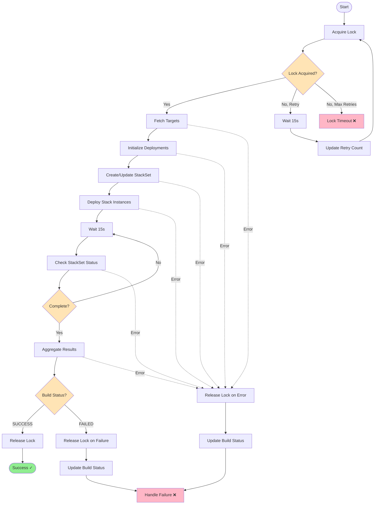
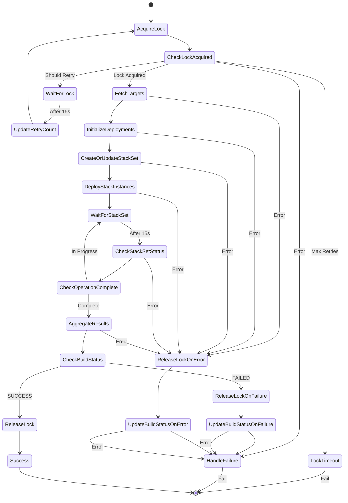

# Multi-Account Step Function Documentation

This document describes the multi-account CloudFormation deployment workflow implemented as an AWS Step Functions state machine. The workflow deploys CloudFormation templates across multiple AWS accounts and regions using AWS StackSets.

## Architecture Overview

The multi-account deployment uses a state machine that coordinates 8 Lambda functions to deploy infrastructure across multiple accounts and regions. The deployment is protected by a distributed lock to prevent concurrent deployments to the same repository/environment combination.

### Workflow Flow



## Lambda Functions

### 1. acquire-lock

**Location:** `internal/lambda/step-functions/multi-account/acquire-lock/main.go`

#### Summary
Acquires a distributed deployment lock to prevent concurrent deployments to the same repository/environment combination. Implements retry logic with exponential backoff.

#### CloudFormation Operations
- None

#### DynamoDB Operations
- **Table:** `{env}-aws-deployer-locks`
- **Operations:**
  - `lockDAO.Acquire()` - Attempts to acquire a lock using conditional writes
  - `lockDAO.Find()` - Retrieves current lock holder information

#### Expected Input
```json
{
  "env": "dev",
  "repo": "my-repo",
  "sk": "2Abc123XYZ",
  "execution_arn": "arn:aws:states:us-east-1:123456789012:execution:...",
  "retry_count": 0
}
```

| Field | Description |
|-------|-------------|
| `env` | Environment name (dev, staging, prod) |
| `repo` | Repository name |
| `sk` | Build KSUID identifier |
| `execution_arn` | Step Function execution ARN (used as lock holder identifier) |
| `retry_count` | Number of retry attempts (incremented by state machine) |

#### Output
```json
{
  "lock_acquired": true,
  "retry_count": 0,
  "should_retry": false,
  "message": "Lock acquired"
}
```

#### Failure Modes

1. **Lock held by another build**
   - Returns `lock_acquired: false` and `should_retry: true`
   - State machine waits 15 seconds and retries
   - Maximum 10 retries (5 minutes total)

2. **Lock timeout**
   - After 10 retries, returns error
   - State machine transitions to `LockTimeout` fail state

3. **DynamoDB errors**
   - Network issues, throttling, or permission errors
   - Transitions to `HandleFailure` state

---

### 2. fetch-targets

**Location:** `internal/lambda/step-functions/multi-account/fetch-targets/main.go`

#### Summary
Fetches deployment target accounts and regions from DynamoDB. Supports repository-specific targets with fallback to default targets.

#### CloudFormation Operations
- None

#### DynamoDB Operations
- **Table:** `{env}-aws-deployer-targets`
- **Operations:**
  - `targetDAO.GetWithDefault()` - Gets targets for repo/env with fallback to defaults
  - `targetdao.ExpandTargets()` - Expands account/region combinations

#### Expected Input
```json
{
  "env": "dev",
  "repo": "my-repo",
  "sk": "2Abc123XYZ"
}
```

#### Output
```json
{
  "targets": [
    {"account_id": "123456789012", "region": "us-east-1"},
    {"account_id": "123456789012", "region": "us-west-2"},
    {"account_id": "987654321098", "region": "us-east-1"}
  ],
  "count": 3
}
```

#### Failure Modes

1. **No targets configured**
   - No targets found for repo/env and no default targets
   - Returns error: "no deployment targets configured"
   - Transitions to `ReleaseLockOnError` state

2. **DynamoDB errors**
   - Network issues, throttling, or permission errors
   - Transitions to `ReleaseLockOnError` state

---

### 3. initialize-deployments

**Location:** `internal/lambda/step-functions/multi-account/initialize-deployments/main.go`

#### Summary
Creates PENDING deployment records in DynamoDB for each target account/region combination. These records are later updated with deployment status.

#### CloudFormation Operations
- None

#### DynamoDB Operations
- **Table:** `{env}-aws-deployer-deployments`
- **Operations:**
  - `deploymentDAO.Create()` - Creates a deployment record for each target (batch)

#### Expected Input
```json
{
  "env": "dev",
  "repo": "my-repo",
  "sk": "2Abc123XYZ",
  "targets": [
    {"account_id": "123456789012", "region": "us-east-1"},
    {"account_id": "123456789012", "region": "us-west-2"}
  ]
}
```

#### Output
```json
{
  "initialized_count": 2
}
```

#### Failure Modes

1. **DynamoDB write failure**
   - One or more deployment records fail to create
   - Returns error with account/region that failed
   - Transitions to `ReleaseLockOnError` state

2. **Throttling**
   - DynamoDB write capacity exceeded
   - Returns throttling error
   - Transitions to `ReleaseLockOnError` state

---

### 4. create-stackset

**Location:** `internal/lambda/step-functions/multi-account/create-stackset/main.go`

#### Summary
Creates a new CloudFormation StackSet or updates an existing one with the latest template and parameters. Fetches parameters from S3 and merges base parameters with environment-specific overrides.

#### CloudFormation Operations
- `DescribeStackSet` - Checks if StackSet exists
- `CreateStackSet` - Creates new StackSet (if doesn't exist)
- `UpdateStackSet` - Updates existing StackSet template (no instance updates)

**Important:** This Lambda only updates the StackSet template definition, not the instances. Instance updates happen in the next step (`deploy-stack-instances`).

#### DynamoDB Operations
- **Table:** `{env}-aws-deployer-builds`
- **Operations:**
  - `builddao.UpdateStatus()` - Updates build status to FAILED on error (via middleware)

#### S3 Operations
- Reads `{s3_key}/cloudformation.template` - The CloudFormation template
- Reads `{s3_key}/cloudformation-params.json` - Base parameters (optional)
- Reads `{s3_key}/cloudformation-params.{env}.json` - Environment-specific overrides (optional)

#### Expected Input
```json
{
  "env": "dev",
  "repo": "my-repo",
  "sk": "2Abc123XYZ",
  "s3_bucket": "my-deployment-bucket",
  "s3_key": "my-repo/v1.2.3/"
}
```

#### Output
```json
{
  "stack_set_name": "dev-my-repo",
  "operation": "UPDATE"
}
```

| Field | Description |
|-------|-------------|
| `stack_set_name` | Name of the StackSet (format: `{env}-{repo}`) |
| `operation` | Either "CREATE" or "UPDATE" |

#### Failure Modes

1. **S3 template not found**
   - Template file doesn't exist at specified S3 path
   - Returns error: "failed to fetch template"
   - Transitions to `ReleaseLockOnError` state

2. **Invalid CloudFormation template**
   - Template syntax errors or invalid resources
   - CloudFormation API returns validation error
   - Transitions to `ReleaseLockOnError` state

3. **Parameter file errors**
   - Invalid JSON in parameter files
   - Returns error: "failed to parse JSON"
   - Transitions to `ReleaseLockOnError` state

4. **IAM permissions**
   - Missing permissions for CloudFormation or S3
   - Returns error with permission denied message
   - Transitions to `ReleaseLockOnError` state

5. **No updates needed**
   - Template and parameters unchanged
   - Returns success with "UPDATE" operation
   - Continues to next step (handles gracefully)

#### Notes
- Automatically injects/overrides the `Env` parameter to ensure consistency
- Supports IAM capabilities: `CAPABILITY_IAM`, `CAPABILITY_NAMED_IAM`
- Uses `ADMINISTRATION_ROLE_ARN` from environment variable
- Uses fixed execution role name from `constants.ExecutionRoleName`

---

### 5. deploy-stack-instances

**Location:** `internal/lambda/step-functions/multi-account/deploy-stack-instances/main.go`

#### Summary
Deploys or updates CloudFormation stack instances to target accounts and regions. Intelligently determines whether to create new instances or update existing ones. Includes retry logic for concurrent operation conflicts.

#### CloudFormation Operations
- `ListStackInstances` - Lists existing stack instances (paginated)
- `CreateStackInstances` - Creates new stack instances
- `UpdateStackInstances` - Updates existing stack instances

#### DynamoDB Operations
- None

#### Expected Input
```json
{
  "stack_set_name": "dev-my-repo",
  "targets": [
    {"account_id": "123456789012", "region": "us-east-1"},
    {"account_id": "123456789012", "region": "us-west-2"}
  ]
}
```

#### Output
```json
{
  "operation_id": "4639ab1f-c0d1-4a31-9939-19f101f968a7",
  "account_ids": ["123456789012"],
  "regions": ["us-east-1", "us-west-2"]
}
```

#### Failure Modes

1. **OperationInProgressException**
   - Another StackSet operation is already running
   - Returns error for Step Functions retry
   - Step Functions retries with exponential backoff (up to 20 attempts)
   - Total retry time: ~30 minutes with 1.5x backoff

2. **Insufficient permissions**
   - Missing IAM permissions in target accounts
   - CloudFormation returns permission error
   - Transitions to `ReleaseLockOnError` state

3. **StackSet not found**
   - StackSet was deleted between steps
   - Returns error: "StackSetNotFoundException"
   - Transitions to `ReleaseLockOnError` state

4. **Invalid account/region**
   - Target account or region doesn't exist or isn't enabled
   - CloudFormation returns validation error
   - Transitions to `ReleaseLockOnError` state

#### Operation Preferences
- `MaxConcurrentCount`: 10 (deploys to 10 accounts/regions concurrently)
- `FailureToleranceCount`: 0 (fail fast to track all failures)

#### Notes
- Extracts unique accounts and regions from targets
- Checks for existing instances before creating
- Falls back to update if all instances already exist
- Retries are handled by Step Functions, not the Lambda

---

### 6. check-stackset-status

**Location:** `internal/lambda/step-functions/multi-account/check-stackset-status/main.go`

#### Summary
Polls the status of a StackSet operation and individual stack instances. Updates deployment records in DynamoDB with current status and retrieves stack events for failed deployments.

#### CloudFormation Operations
- `DescribeStackSetOperation` - Gets overall operation status
- `DescribeStackInstance` - Gets individual instance status (for each target)
- `DescribeStackEvents` - Gets stack events for failed instances

#### DynamoDB Operations
- **Table:** `{env}-aws-deployer-deployments`
- **Operations:**
  - `deploymentDAO.UpdateStatus()` - Updates deployment status for each target

#### Expected Input
```json
{
  "env": "dev",
  "repo": "my-repo",
  "stack_set_name": "dev-my-repo",
  "operation_id": "4639ab1f-c0d1-4a31-9939-19f101f968a7",
  "targets": [
    {"account_id": "123456789012", "region": "us-east-1"},
    {"account_id": "123456789012", "region": "us-west-2"}
  ]
}
```

#### Output
```json
{
  "operation_status": "RUNNING",
  "is_complete": false,
  "has_failures": false,
  "deployments": [
    {
      "account_id": "123456789012",
      "region": "us-east-1",
      "status": "CURRENT",
      "detailed_status": "SUCCEEDED",
      "stack_id": "arn:aws:cloudformation:us-east-1:123456789012:stack/..."
    },
    {
      "account_id": "123456789012",
      "region": "us-west-2",
      "status": "OUTDATED",
      "detailed_status": "FAILED",
      "status_reason": "Resource creation failed",
      "stack_id": "arn:aws:cloudformation:us-west-2:123456789012:stack/...",
      "stack_events": [
        "MyResource: CREATE_FAILED - Resource limit exceeded"
      ]
    }
  ]
}
```

#### Status Definitions

**Operation Status:**
- `RUNNING` - Operation in progress
- `SUCCEEDED` - Operation completed successfully
- `FAILED` - Operation failed
- `STOPPING` - Operation being stopped
- `STOPPED` - Operation was stopped

**Instance Status (sync state):**
- `CURRENT` - Stack instance successfully deployed and up-to-date
- `OUTDATED` - Stack instance failed to update (drift or deployment failure)
- `INOPERABLE` - Stack instance is in a bad state and cannot be updated

**Instance Detailed Status (operation progress):**
- `PENDING` - Operation is queued (non-terminal)
- `RUNNING` - Operation is actively executing (non-terminal)
- `SUCCEEDED` - Operation completed successfully (terminal)
- `FAILED` - Operation failed (terminal)
- `CANCELLED` - Operation was cancelled (terminal)
- `INOPERABLE` - Stack instance is inoperable (terminal)
- `SKIPPED_SUSPENDED_ACCOUNT` - Operation skipped due to suspended account (terminal)

#### Failure Modes

1. **Operation not found**
   - Operation ID doesn't exist
   - Returns error: "OperationNotFoundException"
   - Transitions to `ReleaseLockOnError` state

2. **Instance not found**
   - Stack instance doesn't exist for an expected target
   - Returns error: "StackInstanceNotFoundException"
   - Continues checking other instances (non-fatal)

3. **DynamoDB update failure**
   - Failed to update deployment status
   - Logs warning but continues (non-fatal)
   - Status will be outdated in database

4. **Partial failures**
   - Some instances succeed, others fail
   - Sets `has_failures: true`
   - Continues to completion
   - Results aggregated in next step

#### Notes
- Checks instance status concurrently (8 at a time) for performance
- Retrieves up to 5 most recent failed events for debugging
- Uses `DetailedStatus` to determine if operations are still in progress
- Only marks complete when both operation AND all instances are in terminal `DetailedStatus`
- Updates DynamoDB after each status check (every 15 seconds via state machine)
- The `Status` field shows sync state (CURRENT/OUTDATED/INOPERABLE)
- The `DetailedStatus` field shows operation progress (PENDING/RUNNING/SUCCEEDED/FAILED)

---

### 7. aggregate-results

**Location:** `internal/lambda/step-functions/multi-account/aggregate-results/main.go`

#### Summary
Queries all deployment records for the build, aggregates success/failure counts, and updates the overall build status. Determines if deployment was fully successful, partially successful, or completely failed.

#### CloudFormation Operations
- None

#### DynamoDB Operations
- **Table:** `{env}-aws-deployer-deployments`
  - `deploymentDAO.QueryByBuild()` - Queries all deployments for this build

- **Table:** `{env}-aws-deployer-builds`
  - `dbService.UpdateBuildStatus()` - Updates overall build status

#### Expected Input
```json
{
  "env": "dev",
  "repo": "my-repo",
  "sk": "2Abc123XYZ"
}
```

#### Output
```json
{
  "build_status": "FAILED",
  "partial_success": true,
  "failed_deployments": ["123456789012/us-west-2"],
  "deployment_summary": {
    "total": 2,
    "succeeded": 1,
    "failed": 1
  },
  "error_msg": "1 of 2 deployments failed"
}
```

#### Build Status Logic

| Condition | Build Status | Partial Success |
|-----------|--------------|-----------------|
| All succeeded | `SUCCESS` | `false` |
| Some failed | `FAILED` | `true` |
| All failed | `FAILED` | `false` |

#### Failure Modes

1. **No deployments found**
   - Query returns empty result
   - Indicates previous step failed to create deployment records
   - Total count will be 0

2. **DynamoDB query error**
   - Network issues or throttling
   - Returns error: "failed to query deployments"
   - Transitions to `ReleaseLockOnError` state

3. **Build status update failure**
   - Failed to update build record
   - Logs warning but continues (non-fatal)
   - Returns aggregated results anyway

4. **Invalid input**
   - Missing env, repo, or sk fields
   - Returns validation error
   - Transitions to `ReleaseLockOnError` state

#### Notes
- Counts deployment statuses from DynamoDB records (not CloudFormation)
- Relies on `check-stackset-status` having updated deployment records
- Partial success still results in `FAILED` build status
- Failed deployment keys are in format: `{account}/{region}`

---

### 8. release-lock

**Location:** `internal/lambda/step-functions/multi-account/release-lock/main.go`

#### Summary
Releases the distributed deployment lock to allow subsequent deployments. Uses conditional delete to ensure only the lock holder can release it.

#### CloudFormation Operations
- None

#### DynamoDB Operations
- **Table:** `{env}-aws-deployer-locks`
- **Operations:**
  - `lockDAO.Release()` - Conditionally deletes lock (only if owned by this build)

#### Expected Input
```json
{
  "env": "dev",
  "repo": "my-repo",
  "sk": "2Abc123XYZ"
}
```

#### Output
```json
{
  "released": true,
  "message": "Lock released"
}
```

#### Failure Modes

1. **Lock not held by this build**
   - Conditional delete fails (lock owned by different build ID)
   - Returns error: "failed to release lock"
   - This shouldn't happen in normal flow

2. **Lock already released**
   - Lock record doesn't exist
   - Conditional delete succeeds anyway (idempotent)
   - Returns success

3. **DynamoDB errors**
   - Network issues or permission errors
   - Returns error
   - Lock may remain in database (will eventually be cleaned up by TTL)

#### Notes
- Called in success path: `AggregateResults → CheckBuildStatus → ReleaseLock → Success`
- Called in failure paths: `ReleaseLockOnFailure`, `ReleaseLockOnError`
- Lock release is attempted even if deployment failed
- Failures during lock release are logged but don't fail the state machine

---

## State Machine Flow

### Complete Workflow

The state machine coordinates all Lambda functions with error handling, retries, and lock management:



### Key Flow Characteristics

**Lock Acquisition (with retry)**
- Attempts to acquire lock with conditional write
- Retries up to 10 times with 15-second intervals
- Total max wait time: 5 minutes
- Fails if lock cannot be acquired

**Status Polling (until complete)**
- Checks StackSet operation and instance status
- Polls every 15 seconds
- Continues until all instances reach terminal state
- Can run for extended periods (hours for large deployments)

**Error Handling**
- All errors trigger lock release before failing
- Attempts to update build status even on error
- Ensures locks don't remain held after failures

## Common Error Scenarios

### 1. Concurrent Deployments
**Symptom:** Lock acquisition fails repeatedly
**Cause:** Another deployment is running for same repo/env
**Resolution:** Wait for previous deployment to complete (max 5 minutes)
**State Machine:** Retries with 15s intervals, eventually times out

### 2. StackSet Operation Conflict
**Symptom:** `OperationInProgressException` from `deploy-stack-instances`
**Cause:** Manual StackSet operation or previous deployment still running
**Resolution:** Step Functions retries automatically (up to 20 times, ~30 minutes)
**State Machine:** Exponential backoff with 1.5x multiplier

### 3. Partial Deployment Failure
**Symptom:** Some accounts succeed, others fail
**Cause:** Resource limits, permissions, or configuration issues in specific accounts
**Resolution:** Check `failed_deployments` array in output, investigate CloudFormation events
**State Machine:** Completes successfully but marks build as FAILED with `partial_success: true`

### 4. Template Validation Error
**Symptom:** `create-stackset` fails with validation error
**Cause:** Invalid CloudFormation template syntax or unsupported resources
**Resolution:** Fix template and retry deployment
**State Machine:** Releases lock and fails immediately

### 5. Target Configuration Missing
**Symptom:** `fetch-targets` fails with "no deployment targets configured"
**Cause:** No targets configured for repo/env and no defaults exist
**Resolution:** Configure deployment targets in DynamoDB
**State Machine:** Releases lock and fails immediately

## DynamoDB Tables

### Locks Table: `{env}-aws-deployer-locks`
```
PK: LOCK#dev#my-repo
Attributes:
- BuildID: "2Abc123XYZ"
- ExecutionArn: "arn:aws:states:..."
- TTL: (auto-cleanup)
```

### Targets Table: `{env}-aws-deployer-targets`
```
PK: REPO#my-repo
SK: ENV#dev
Attributes:
- Targets: [{"AccountID": "...", "Regions": ["us-east-1", "us-west-2"]}]
```

### Deployments Table: `{env}-aws-deployer-deployments`
```
PK: REPO#my-repo#ENV#dev
SK: BUILD#2Abc123XYZ#123456789012/us-east-1
Attributes:
- Status: "SUCCESS" | "FAILED" | "IN_PROGRESS"
- StackID: "arn:aws:cloudformation:..."
- StatusReason: "..." (if failed)
- StackEvents: ["..."] (if failed)
```

### Builds Table: `{env}-aws-deployer-builds`
```
PK: REPO#my-repo#ENV#dev
SK: 2Abc123XYZ
Attributes:
- Status: "SUCCESS" | "FAILED" | "IN_PROGRESS"
- ErrorMsg: "..." (if failed)
- Version: "v1.2.3"
- CommitHash: "abc123"
```

## Environment Variables

### create-stackset Lambda
- `ADMINISTRATION_ROLE_ARN` - ARN of the IAM role for StackSet administration (required)

### All Lambdas
- `ENV` - Environment name (dev, staging, prod) for table name resolution

## Performance Characteristics

- **Lock acquisition:** 15 seconds between retries, max 5 minutes total
- **StackSet operation conflict:** 30 seconds between retries, max 30 minutes total
- **Status polling:** 15 seconds between checks, continues until all instances terminal
- **Concurrent instance checks:** 8 parallel requests to CloudFormation
- **Concurrent deployments:** 10 stack instances deployed simultaneously

## Best Practices

1. **Always configure deployment targets** before triggering deployments
2. **Monitor lock acquisition times** - long waits indicate frequent deployments
3. **Set appropriate IAM permissions** in all target accounts
4. **Use S3 versioning** for templates and parameters
5. **Test templates in dev** before deploying to production
6. **Check CloudFormation quotas** in target accounts (stack limits, resources)
7. **Monitor DynamoDB capacity** - consider on-demand pricing for burst workloads
